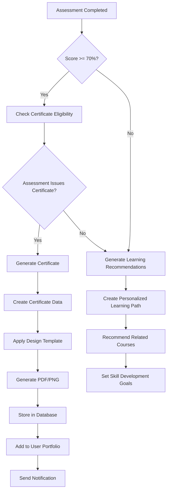
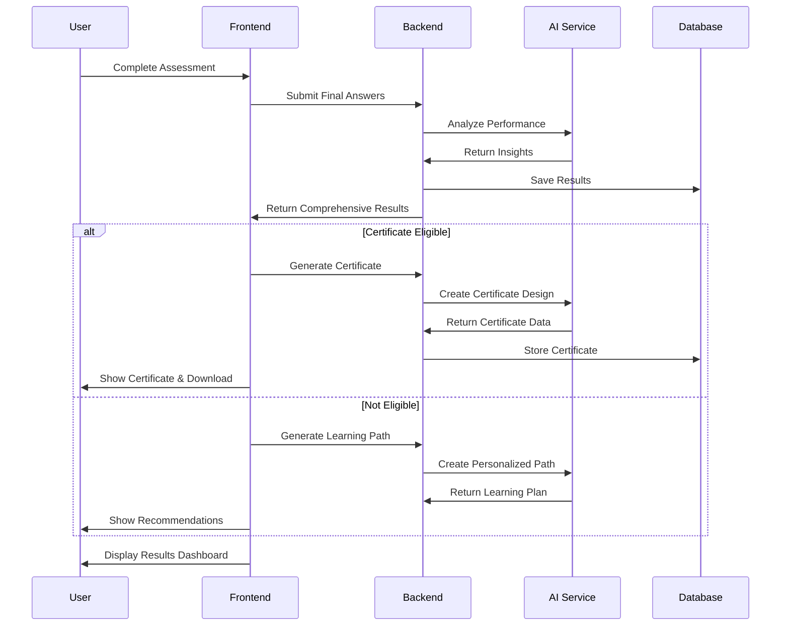
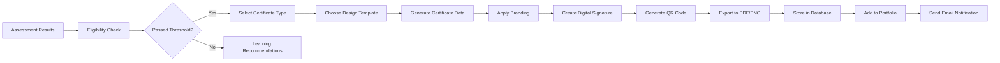

# Assessment Completion Roadmap

## Overview
This document outlines the complete implementation plan for assessment completion flow, certificate generation, and personalized learning path creation.

## 1. Assessment Completion Flow

### Current State
- ✅ Basic assessment completion (score calculation)
- ✅ Redux state management
- ❌ Results dashboard
- ❌ Certificate generation
- ❌ Skill updates
- ❌ Personalized recommendations

### Target State
Complete end-to-end flow with results dashboard, certificate generation, and personalized learning paths.

## 2. Implementation Phases

### Phase 1: Results Dashboard (Priority: High)
**Timeline: 1-2 weeks**

#### 1.1 Create Results Dashboard Component
```typescript
// frontend/components/assessments/results-dashboard.tsx
interface AssessmentResults {
  score: number;
  passed: boolean;
  timeSpent: number;
  questionsAnswered: number;
  correctAnswers: number;
  skillGaps: string[];
  recommendations: string[];
  certificateEligible: boolean;
}
```

#### 1.2 Backend API Enhancement
```javascript
// backend/controllers/assessmentController.js
const completeAssessment = async (req, res) => {
  // 1. Calculate final results
  // 2. Check certificate eligibility
  // 3. Generate AI insights
  // 4. Create personalized recommendations
  // 5. Update user skills
  // 6. Return comprehensive results
};
```

#### 1.3 Results Dashboard Features
- **Score Breakdown**: Detailed analysis of performance
- **Skill Gap Analysis**: AI-powered insights on weak areas
- **Performance Metrics**: Time spent, accuracy, speed
- **Certificate Status**: Eligibility and generation options
- **Next Steps**: Personalized recommendations

### Phase 2: Certificate System (Priority: High)
**Timeline: 2-3 weeks**

#### 2.1 Certificate Eligibility Logic
```javascript
// Certificate eligibility criteria
const certificateEligibility = {
  minimumScore: 70, // Configurable per assessment
  minimumAttempts: 1,
  timeLimit: null, // Optional time constraints
  skillRequirements: [], // Required skills to demonstrate
  assessmentType: ['completion', 'mastery', 'certification']
};
```

#### 2.2 Certificate Design System
```typescript
// Certificate design templates
interface CertificateTemplate {
  id: string;
  name: string;
  type: 'achievement' | 'completion' | 'mastery';
  design: {
    layout: 'modern' | 'classic' | 'minimal';
    colors: string[];
    fonts: string[];
    elements: CertificateElement[];
  };
  content: {
    title: string;
    subtitle: string;
    issuer: string;
    verification: VerificationInfo;
  };
}
```

#### 2.3 Certificate Generation Process


#### 2.4 Certificate Features
- **Multiple Formats**: PDF, PNG, SVG for different use cases
- **Verification System**: QR codes, unique IDs, blockchain verification
- **Sharing Integration**: LinkedIn, Twitter, portfolio export
- **Customization**: User can choose design templates
- **Analytics**: Track certificate views and shares

### Phase 3: Skill Management System (Priority: Medium)
**Timeline: 1-2 weeks**

#### 3.1 Skill Update Process
```javascript
// Skill update after assessment
const updateUserSkills = async (userId, assessmentResults) => {
  // 1. Extract skills from assessment
  // 2. Calculate new skill levels
  // 3. Update user profile
  // 4. Trigger recommendations
  // 5. Update learning paths
};
```

#### 3.2 Skill Level Calculation
```typescript
interface SkillLevel {
  beginner: { min: 0, max: 30 };
  intermediate: { min: 31, max: 70 };
  advanced: { min: 71, max: 90 };
  expert: { min: 91, max: 100 };
}
```

### Phase 4: Personalized Learning Paths (Priority: Medium)
**Timeline: 2-3 weeks**

#### 4.1 Learning Path Generation
```javascript
// AI-powered learning path creation
const generatePersonalizedPath = async (userId, assessmentResults) => {
  // 1. Analyze skill gaps
  // 2. Identify learning objectives
  // 3. Select relevant modules
  // 4. Create adaptive content
  // 5. Set milestones and goals
};
```

#### 4.2 Learning Path Features
- **Adaptive Content**: Adjusts difficulty based on performance
- **Skill Mapping**: Directly addresses identified gaps
- **Progress Tracking**: Real-time progress monitoring
- **Milestone Rewards**: Gamification elements
- **Social Learning**: Peer collaboration features

## 3. Technical Implementation

### 3.1 Database Schema Updates
```javascript
// New collections/tables needed
const newSchemas = {
  certificates: CertificateSchema,
  learningPaths: LearningPathSchema,
  skillProgress: SkillProgressSchema,
  assessmentResults: AssessmentResultsSchema
};
```

### 3.2 API Endpoints
```javascript
// New API endpoints
const newEndpoints = [
  'POST /api/assessments/:id/complete',
  'GET /api/assessments/:id/results',
  'POST /api/certificates/generate',
  'GET /api/certificates/:id/download',
  'POST /api/learning-paths/generate',
  'PUT /api/users/:id/skills'
];
```

### 3.3 Frontend Components
```typescript
// New React components
const newComponents = [
  'ResultsDashboard',
  'CertificateViewer',
  'LearningPathBuilder',
  'SkillProgressTracker',
  'RecommendationsPanel'
];
```

## 4. User Experience Flow

### 4.1 Assessment Completion Journey


### 4.2 Certificate Generation Flow


## 5. Success Metrics

### 5.1 User Engagement
- Certificate download rate
- Learning path completion rate
- Time spent on results dashboard
- Return assessment rate

### 5.2 Technical Performance
- Certificate generation time (< 5 seconds)
- API response time (< 2 seconds)
- Error rate (< 1%)
- User satisfaction score (> 4.5/5)

### 5.3 Business Impact
- User retention rate
- Certificate sharing rate
- Learning path enrollment rate
- Skill improvement tracking

## 6. Risk Mitigation

### 6.1 Technical Risks
- **Certificate Generation Failures**: Implement fallback designs
- **AI Service Downtime**: Cache recommendations, use static fallbacks
- **Performance Issues**: Implement caching and CDN for certificates

### 6.2 User Experience Risks
- **Complex Flow**: Simplify user journey, add progress indicators
- **Long Wait Times**: Show loading states, implement progressive loading
- **Confusing Results**: Provide clear explanations and next steps

## 7. Testing Strategy

### 7.1 Unit Tests
- Certificate generation logic
- Skill calculation algorithms
- API endpoint functionality
- Component rendering

### 7.2 Integration Tests
- End-to-end assessment flow
- Certificate download process
- Learning path generation
- Database operations

### 7.3 User Acceptance Tests
- Complete user journey testing
- Cross-browser compatibility
- Mobile responsiveness
- Accessibility compliance

## 8. Deployment Plan

### 8.1 Phase 1 Deployment
1. Deploy results dashboard
2. Test with sample assessments
3. Gather user feedback
4. Iterate and improve

### 8.2 Phase 2 Deployment
1. Deploy certificate system
2. Test certificate generation
3. Validate design templates
4. Monitor performance

### 8.3 Phase 3 Deployment
1. Deploy skill management
2. Test skill updates
3. Validate recommendations
4. Monitor user engagement

## 9. Future Enhancements

### 9.1 Advanced Features
- **Blockchain Certificates**: Immutable certificate storage
- **AI Tutoring**: Personalized learning assistance
- **Social Learning**: Peer collaboration features
- **Gamification**: Badges, achievements, leaderboards

### 9.2 Integration Opportunities
- **LMS Integration**: Connect with external learning platforms
- **HR Systems**: Export certificates for professional development
- **Job Platforms**: Share skills and certificates
- **Analytics Platforms**: Advanced learning analytics

## 10. Conclusion

This roadmap provides a comprehensive plan for implementing a complete assessment completion system. The phased approach ensures manageable development cycles while delivering value at each stage. The focus on user experience, technical performance, and business impact will create a robust and engaging learning platform.

**Next Steps:**
1. Begin Phase 1 implementation (Results Dashboard)
2. Set up development environment and testing framework
3. Create detailed technical specifications for each component
4. Establish success metrics and monitoring systems
