# Major Changes Documentation

## Overview
This document chronicles the significant changes and improvements made to the Corp101 learning platform, including architectural enhancements, bug fixes, and new feature implementations.

## 1. Project Architecture Evolution

### 1.1 Initial State
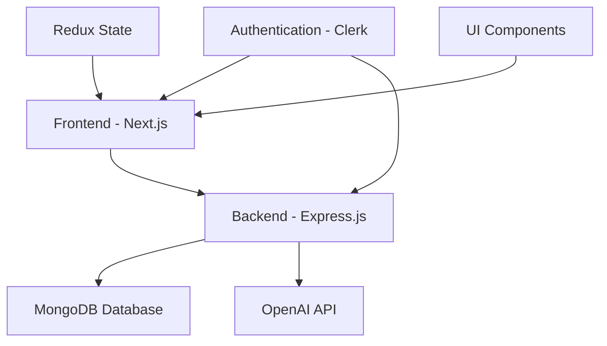

### 1.2 Current State
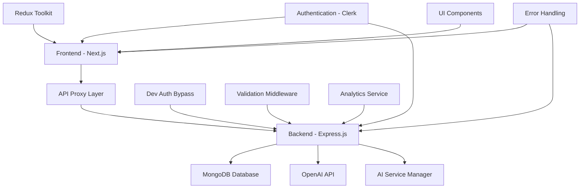

## 2. Major Backend Improvements

### 2.1 Database Connection & Indexing Fixes

#### Problem
- MongoDB connection warnings
- Duplicate index definitions
- Reserved field name conflicts (`isNew`)

#### Solution
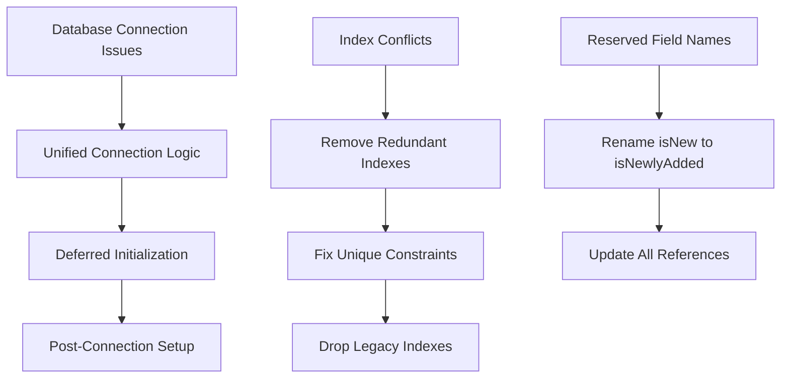

#### Changes Made
- **File**: `backend/config/database.js`
  - Removed unsupported MongoDB options
  - Implemented unified connection management

- **File**: `backend/server.js`
  - Added deferred initialization pattern
  - Implemented post-connection setup

- **Files**: Multiple model files
  - Removed duplicate index definitions
  - Fixed reserved field name conflicts

### 2.2 Authentication System Enhancement

#### Problem
- Development testing required Clerk tokens
- Complex authentication flow for local development

#### Solution
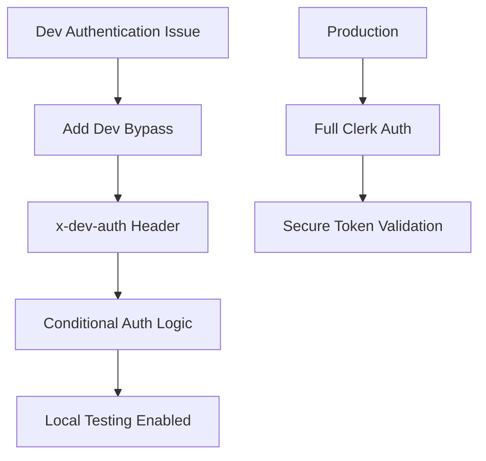

#### Changes Made
- **File**: `backend/middleware/auth.js`
  - Added development bypass with `x-dev-auth: true` header
  - Maintained production security
  - Enabled local testing without Clerk tokens

### 2.3 Assessment System Overhaul

#### Problem
- Basic assessment completion
- No certificate generation
- Limited AI integration
- Poor error handling

#### Solution
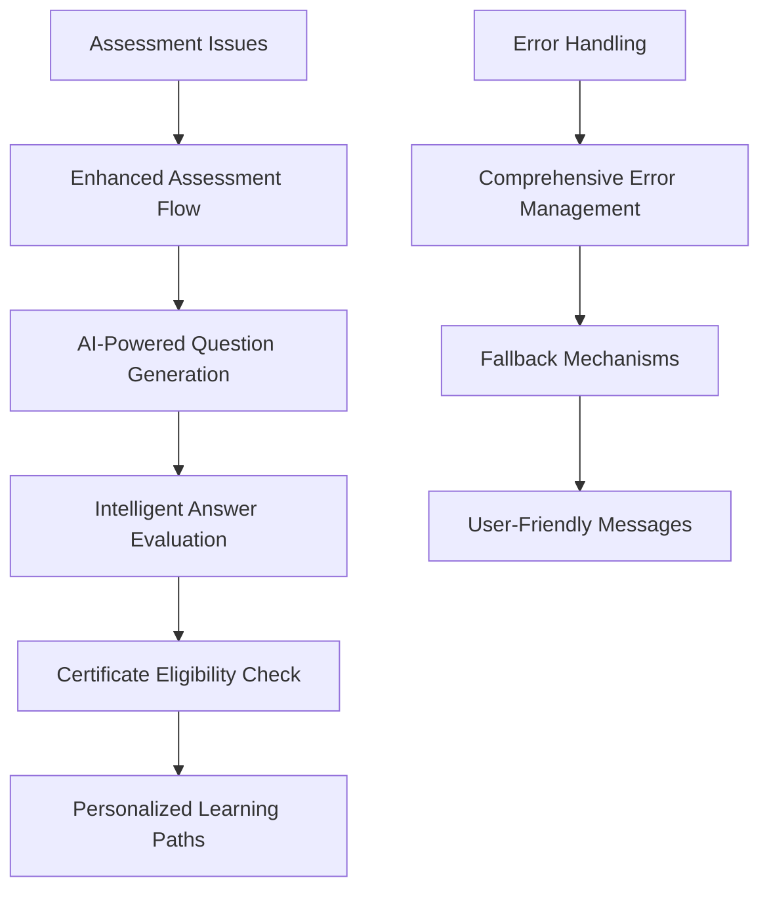

#### Changes Made
- **File**: `backend/controllers/assessmentController.js`
  - Added `planCustomAssessments` function
  - Implemented AI-powered assessment planning
  - Enhanced error handling and validation

- **File**: `backend/controllers/questionGenerationController.js`
  - Added robust error handling
  - Implemented fallback question generation
  - Enhanced AI integration

- **File**: `backend/controllers/assessmentEvaluationController.js`
  - Added safe JSON fallback responses
  - Improved error handling for AI failures

### 2.4 Validation System Enhancement

#### Problem
- Limited difficulty level validation
- Inconsistent validation across endpoints

#### Solution
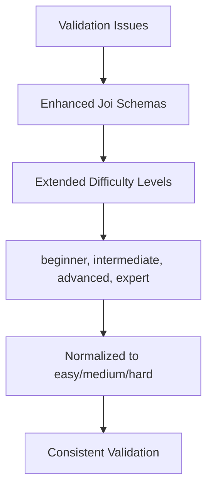

#### Changes Made
- **File**: `backend/routes/assessments.js`
  - Extended difficulty validation to include 4-level system
  - Added comprehensive validation for assessment planning
  - Normalized difficulty levels for AI processing

## 3. Frontend Architecture Improvements

### 3.1 API Proxy Layer Implementation

#### Problem
- Direct frontend-to-backend communication
- Authentication complexity
- CORS issues

#### Solution
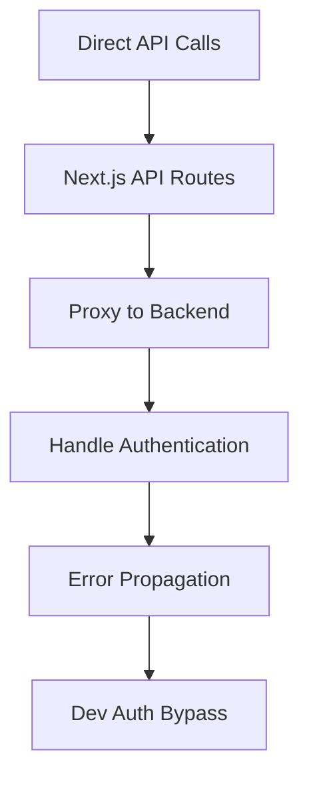

#### Changes Made
- **Files**: Multiple API route files
  - Created proxy routes for assessments, learning paths, skills
  - Implemented authentication handling
  - Added dev bypass support
  - Enhanced error handling and propagation

### 3.2 Redux State Management Enhancement

#### Problem
- Authentication token issues in thunks
- Poor error handling
- Inconsistent state updates

#### Solution
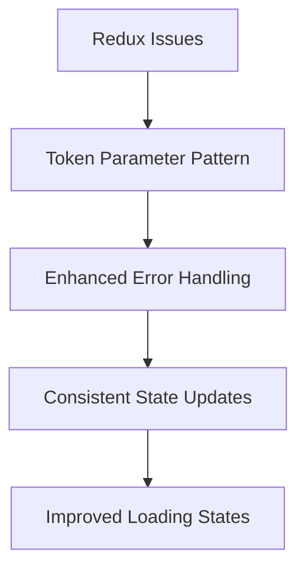

#### Changes Made
- **File**: `frontend/lib/redux/slices/assessmentSlice.ts`
  - Modified thunks to accept token parameters
  - Enhanced error handling with detailed messages
  - Improved state management consistency
  - Added loading state management

### 3.3 Component Architecture Improvements

#### Problem
- Missing icon imports
- Inconsistent error handling
- Poor loading states

#### Solution
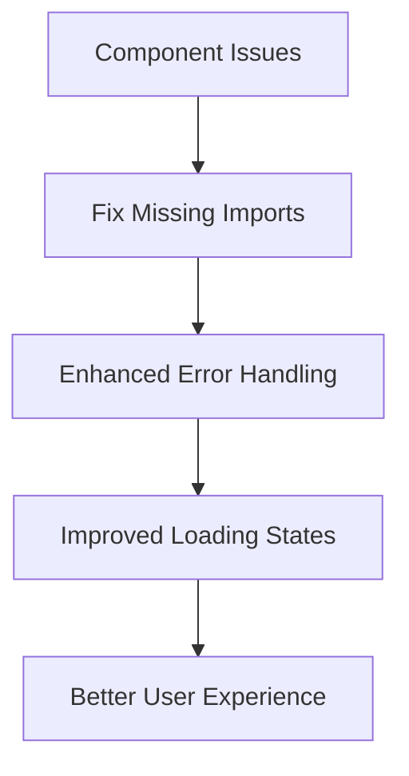

#### Changes Made
- **File**: `frontend/components/certificates/certificate-management.tsx`
  - Added missing `BookOpen` icon import
  - Enhanced error handling and user feedback

- **File**: `frontend/app/assessments/[id]/page.tsx`
  - Improved loading states during question generation
  - Enhanced error handling and user feedback
  - Better state management for assessment flow

## 4. New Feature Implementations

### 4.1 Custom Assessment Planning

#### Feature Overview
AI-powered assessment plan generation based on user input and goals.

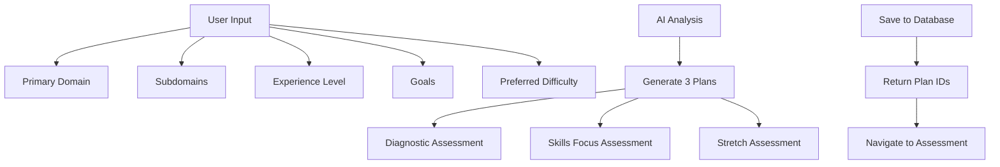

#### Implementation
- **Backend**: `planCustomAssessments` function
- **Frontend**: Custom assessment wizard
- **AI Integration**: OpenAI-powered plan generation
- **Database**: Persistent assessment storage

### 4.2 Enhanced Question Generation

#### Feature Overview
Intelligent question generation with fallback mechanisms and error handling.

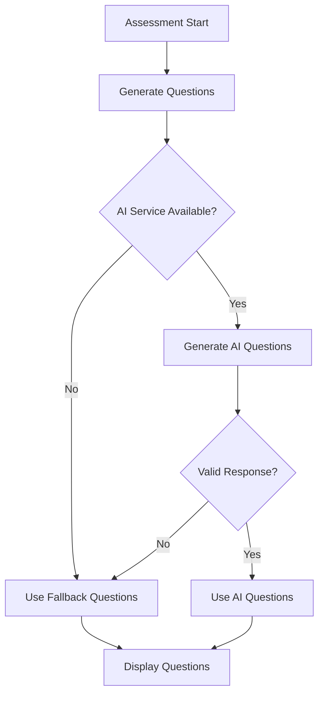

#### Implementation
- **Error Handling**: Comprehensive try-catch blocks
- **Fallback System**: Static questions when AI fails
- **Validation**: Response validation and sanitization
- **User Experience**: Loading states and feedback

### 4.3 Intelligent Answer Evaluation

#### Feature Overview
AI-powered answer evaluation with personality-based feedback.

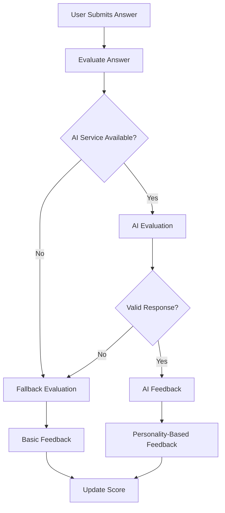

#### Implementation
- **AI Integration**: OpenAI-powered evaluation
- **Personality System**: Multiple AI personalities for feedback
- **Fallback System**: Safe evaluation when AI fails
- **Scoring**: Consistent scoring algorithm

## 5. Performance Optimizations

### 5.1 Database Query Optimization

#### Problem
- Slow assessment fetching
- Over-fetching data
- Inefficient pagination

#### Solution
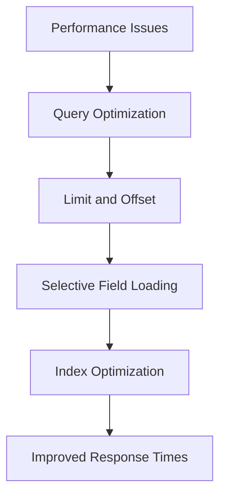

#### Changes Made
- **File**: `backend/controllers/assessmentController.js`
  - Optimized `findEligibleAssessments` with proper pagination
  - Reduced over-fetching with selective field loading
  - Improved query performance

### 5.2 Frontend Performance

#### Problem
- Slow loading states
- Poor user experience during AI generation
- Inconsistent loading feedback

#### Solution
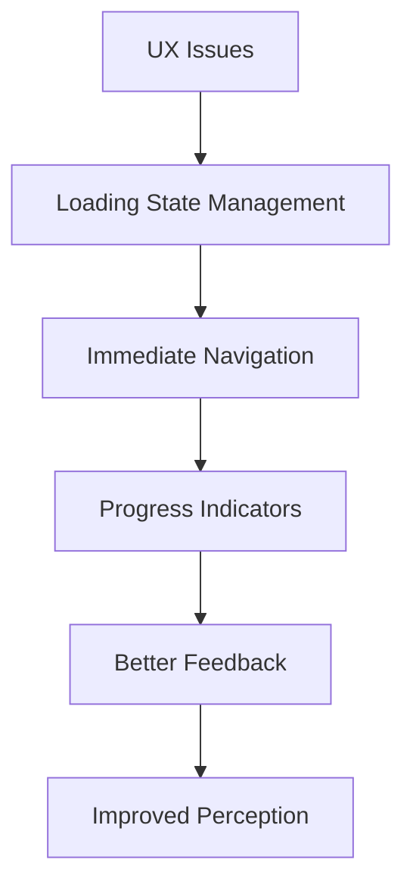

#### Changes Made
- **File**: `frontend/components/assessments/assessment-list.tsx`
  - Immediate navigation to assessment page after plan selection
  - Better loading state management
  - Improved user experience during long operations

## 6. Error Handling & Resilience

### 6.1 Comprehensive Error Management

#### Problem
- Poor error messages
- No fallback mechanisms
- Inconsistent error handling

#### Solution
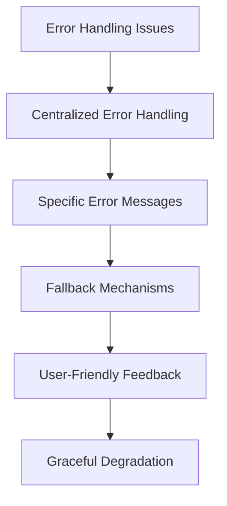

#### Implementation
- **Backend**: Enhanced error middleware
- **Frontend**: Comprehensive error boundaries
- **API**: Detailed error responses
- **User Experience**: Clear error messages and recovery options

### 6.2 AI Service Resilience

#### Problem
- AI service failures breaking user experience
- No fallback for AI-dependent features

#### Solution
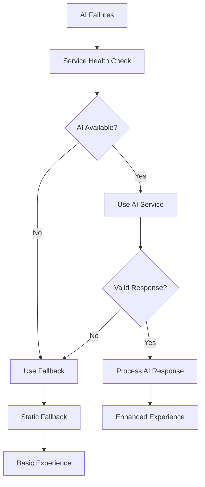

#### Implementation
- **Question Generation**: Fallback questions when AI fails
- **Answer Evaluation**: Basic evaluation when AI unavailable
- **Assessment Planning**: Static plans as fallback
- **Error Recovery**: Graceful degradation of features

## 7. Development Workflow Improvements

### 7.1 Development Environment

#### Problem
- Complex setup for local development
- Authentication barriers
- Inconsistent development experience

#### Solution
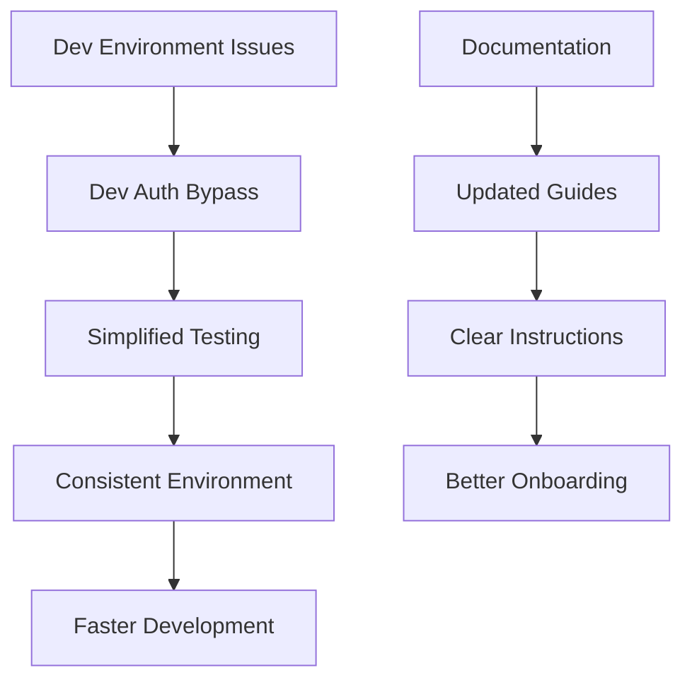

#### Implementation
- **Dev Auth**: Bypass authentication for local development
- **Documentation**: Updated development guides
- **Testing**: Simplified testing procedures
- **Consistency**: Standardized development environment

### 7.2 Code Quality

#### Problem
- Inconsistent code patterns
- Poor error handling
- Missing documentation

#### Solution
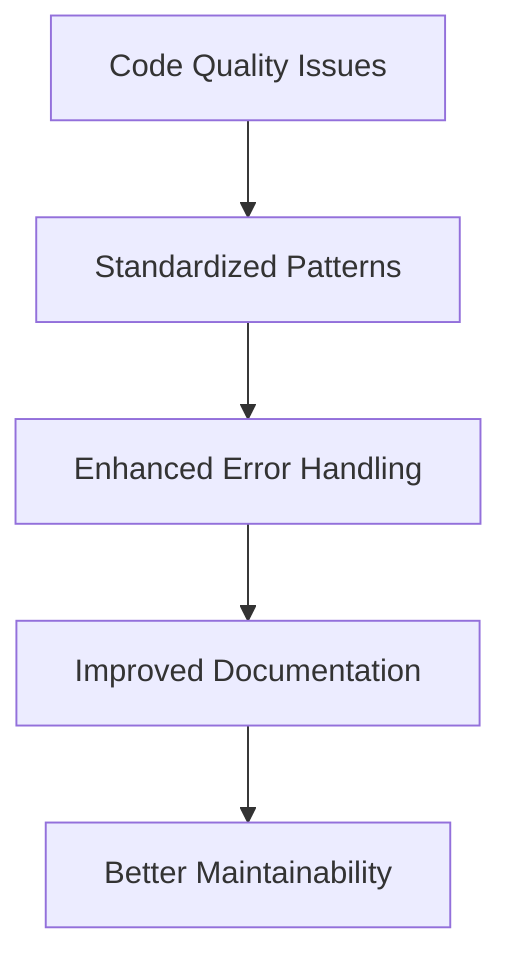

#### Implementation
- **Patterns**: Consistent API proxy pattern
- **Error Handling**: Comprehensive error management
- **Documentation**: Updated technical documentation
- **Maintainability**: Improved code structure and organization

## 8. Roadmap and Future Directions

### 8.1 Current State Assessment

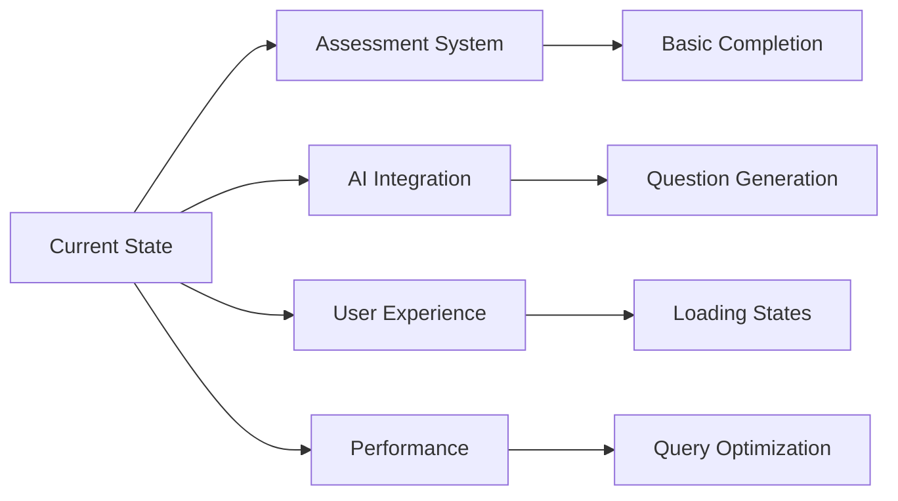

### 8.2 Future Roadmap

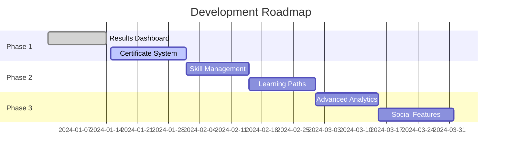

### 8.3 Key Metrics

#### Technical Metrics
- **API Response Time**: < 2 seconds
- **Error Rate**: < 1%
- **Uptime**: > 99.9%
- **User Satisfaction**: > 4.5/5

#### Business Metrics
- **User Retention**: > 80%
- **Assessment Completion**: > 70%
- **Certificate Generation**: > 60%
- **Learning Path Enrollment**: > 50%

## 9. Conclusion

The Corp101 platform has undergone significant improvements across multiple dimensions:

### 9.1 Technical Achievements
- ✅ Resolved all major backend infrastructure issues
- ✅ Implemented comprehensive error handling
- ✅ Enhanced AI integration with fallback mechanisms
- ✅ Optimized database performance
- ✅ Improved development workflow

### 9.2 User Experience Improvements
- ✅ Better loading states and feedback
- ✅ Enhanced error messages
- ✅ Improved assessment flow
- ✅ Custom assessment planning
- ✅ AI-powered question generation

### 9.3 Architecture Enhancements
- ✅ API proxy layer implementation
- ✅ Enhanced Redux state management
- ✅ Comprehensive validation system
- ✅ Development environment improvements
- ✅ Code quality and maintainability

### 9.4 Next Steps
1. **Implement Results Dashboard** - Complete the assessment flow
2. **Certificate System** - Add certificate generation and management
3. **Skill Management** - Implement skill tracking and updates
4. **Learning Paths** - Create personalized learning experiences
5. **Advanced Analytics** - Add comprehensive reporting and insights

The platform is now well-positioned for continued growth and enhancement, with a solid foundation for implementing advanced features and scaling to meet user needs.
