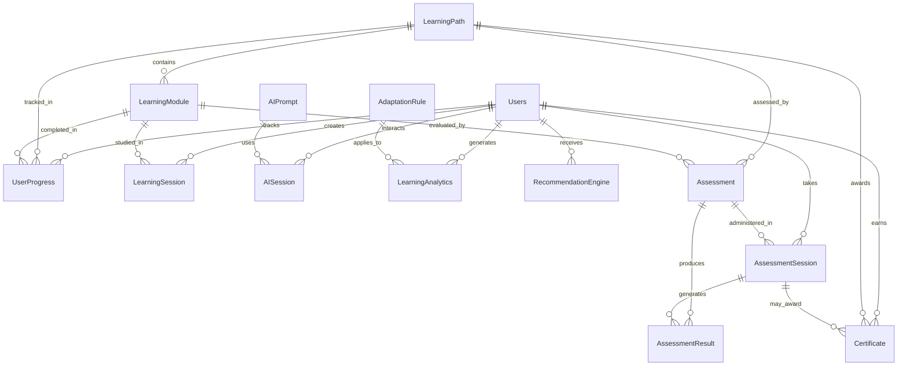

# 🗄️ Sokol Learning Platform - Complete Database Schema

## 📊 Database Architecture Overview

The Sokol platform uses **MongoDB** with **13 core collections** that work together to provide intelligent, adaptive learning experiences.

## 🔗 Entity Relationship Diagram



---

## 📋 Collection Schemas

### 1. 👥 **Users Collection**

**Purpose**: Core user management with learning profiles

```javascript
{
  _id: ObjectId,
  email: String (unique),
  password: String (hashed),
  name: String,
  role: String (student|instructor|admin),
  avatar: String (URL),
  
  // Learning Profile
  learningProfile: {
    learningStyle: String (visual|auditory|kinesthetic|reading),
    aiPersonality: String (ARIA|SAGE|COACH),
    goals: [String],
    interests: [String],
    pace: String (slow|moderate|fast),
    preferredSessionLength: Number, // minutes
    timezone: String,
    language: String,
    difficultyAdjustment: Number, // -2 to +2
    hintsEnabled: Boolean,
    preferredFormat: String,
    aiPreferences: {
      tone: String,
      supportLevel: String,
      explanationDepth: String
    }
  },
  
  // Account Status
  isActive: Boolean,
  isEmailVerified: Boolean,
  emailVerifiedAt: Date,
  lastLoginAt: Date,
  
  // Subscription
  subscription: {
    plan: String,
    status: String,
    expiresAt: Date
  },
  
  createdAt: Date,
  updatedAt: Date
}
```

**Indexes**: email, role, isActive, learningProfile.aiPersonality

---

### 2. 📚 **LearningPaths Collection**

**Purpose**: Learning curriculum structure and organization

```javascript
{
  _id: ObjectId,
  title: String,
  description: String,
  category: String,
  difficulty: String (beginner|intermediate|advanced|expert),
  estimatedDuration: Number, // total minutes
  
  // Content Structure
  skills: [String],
  learningObjectives: [String],
  prerequisites: [String],
  
  // Organization
  orderIndex: Number,
  isPublished: Boolean,
  isActive: Boolean,
  
  // Instructor Info
  instructor: {
    name: String,
    bio: String,
    avatar: String,
    credentials: [String]
  },
  
  // Media
  thumbnail: String,
  trailer: String,
  
  // Metrics
  enrollmentCount: Number,
  completionRate: Number,
  averageRating: Number,
  
  // SEO
  slug: String,
  tags: [String],
  
  createdAt: Date,
  updatedAt: Date
}
```

**Indexes**: category, difficulty, isPublished, slug, tags

---

### 3. 📖 **LearningModules Collection**

**Purpose**: Individual learning units with adaptive content

```javascript
{
  _id: ObjectId,
  title: String,
  description: String,
  learningPath: ObjectId (ref: LearningPath),
  
  // Classification
  category: String,
  difficulty: String,
  estimatedDuration: Number, // minutes
  orderIndex: Number,
  
  // Content
  content: {
    videoUrl: String,
    textContent: String,
    audioUrl: String,
    
    // Adaptive Content Variations
    visualContent: [Object],
    auditoryContent: [Object],
    kinestheticContent: [Object],
    readingContent: [Object],
    
    // Interactive Elements
    interactiveElements: [{
      type: String,
      title: String,
      config: Object
    }],
    
    // Resources
    resources: [{
      title: String,
      type: String,
      url: String,
      description: String
    }]
  },
  
  // Learning Design
  learningObjectives: [String],
  skills: [String],
  prerequisites: [ObjectId], // ref: LearningModule
  
  // Assessment
  hasAssessment: Boolean,
  assessmentWeight: Number,
  
  // Status
  isPublished: Boolean,
  version: String,
  
  createdAt: Date,
  updatedAt: Date
}
```

**Indexes**: learningPath, category, difficulty, orderIndex, isPublished

---

### 4. 📈 **UserProgress Collection**

**Purpose**: Comprehensive progress tracking

```javascript
{
  _id: ObjectId,
  user: ObjectId (ref: User),
  learningPath: ObjectId (ref: LearningPath),
  learningModule: ObjectId (ref: LearningModule),
  
  // Progress Status
  completionStatus: String (not_started|in_progress|completed|failed),
  progressPercentage: Number (0-100),
  
  // Performance Metrics
  timeSpent: Number, // minutes
  finalScore: Number (0-100),
  attemptCount: Number,
  
  // Learning Data
  startedAt: Date,
  completedAt: Date,
  lastAccessedAt: Date,
  
  // Struggle Tracking
  strugglingAreas: [String],
  hintsUsed: Number,
  helpRequestCount: Number,
  
  // Engagement
  engagementScore: Number (0-100),
  interactionCount: Number,
  
  // Notes and Feedback
  personalNotes: String,
  instructorFeedback: String,
  
  createdAt: Date,
  updatedAt: Date
}
```

**Indexes**: user + learningPath + learningModule (compound), completionStatus, completedAt

---

### 5. ⏱️ **LearningSessions Collection**

**Purpose**: Detailed session tracking and analytics

```javascript
{
  _id: ObjectId,
  user: ObjectId (ref: User),
  learningModule: ObjectId (ref: LearningModule),
  
  // Session Details
  startTime: Date,
  endTime: Date,
  duration: Number, // minutes
  
  // Device and Context
  deviceType: String,
  browser: String,
  screenSize: String,
  location: String,
  
  // Engagement Metrics
  engagementScore: Number (0-100),
  focusScore: Number (0-100),
  interactionCount: Number,
  scrollDepth: Number,
  timeOnContent: Number,
  
  // Learning Activities
  activitiesCompleted: [String],
  questionsAnswered: Number,
  correctAnswers: Number,
  
  // Session State
  sessionState: String (active|paused|completed|abandoned),
  bookmarks: [Object],
  
  // AI Interactions
  aiInteractions: Number,
  aiSatisfaction: Number (1-5),
  
  createdAt: Date,
  updatedAt: Date
}
```

**Indexes**: user + startTime (compound), learningModule, sessionState

---

### 6. 🤖 **AIPrompts Collection**

**Purpose**: AI personality templates and contextual prompts

```javascript
{
  _id: ObjectId,
  name: String,
  personality: String (ARIA|SAGE|COACH),
  category: String,
  
  // Prompt Content
  basePrompt: String,
  contextVariables: [String],
  
  // Personalization
  adaptationRules: [{
    condition: String,
    modification: String
  }],
  
  // Usage Context
  learningContext: [String],
  difficultyLevels: [String],
  emotionalStates: [String],
  
  // Performance
  effectivenessScore: Number (0-100),
  usageCount: Number,
  satisfactionScore: Number,
  
  // Metadata
  version: String,
  isActive: Boolean,
  
  createdAt: Date,
  updatedAt: Date
}
```

**Indexes**: personality, category, isActive, effectivenessScore

---

### 7. 💬 **AISessions Collection**

**Purpose**: AI conversation history and context

```javascript
{
  _id: ObjectId,
  user: ObjectId (ref: User),
  learningModule: ObjectId (ref: LearningModule),
  aiPrompt: ObjectId (ref: AIPrompt),
  
  // Session Context
  sessionContext: {
    learningGoal: String,
    currentDifficulty: String,
    emotionalState: String,
    learningStyle: String,
    strugglingWith: [String]
  },
  
  // Conversation
  messages: [{
    role: String (user|assistant),
    content: String,
    timestamp: Date,
    metadata: Object
  }],
  
  // Effectiveness Tracking
  userSatisfaction: Number (1-5),
  helpfulness: Number (1-5),
  resolvedIssue: Boolean,
  
  // Performance
  responseTime: Number, // milliseconds
  tokenUsage: Number,
  
  createdAt: Date,
  updatedAt: Date
}
```

**Indexes**: user + createdAt (compound), learningModule, aiPrompt

---

### 8. 📝 **Assessments Collection**

**Purpose**: Assessment definitions and configurations

```javascript
{
  _id: ObjectId,
  title: String,
  description: String,
  type: String (skill_check|module_completion|path_final|certification),
  category: String,
  difficulty: String,
  
  // Assessment Structure
  questionCount: Number,
  estimatedDuration: Number, // minutes
  passingScore: Number,
  
  // Questions
  questions: [{
    id: String,
    type: String (multiple_choice|true_false|short_answer|essay),
    question: String,
    options: [String], // for multiple choice
    correctAnswer: Mixed,
    points: Number,
    explanation: String,
    difficulty: String,
    skills: [String]
  }],
  
  // Configuration
  timeConstraints: {
    totalTimeLimit: Number,
    questionTimeLimit: Number,
    showTimer: Boolean
  },
  
  attemptSettings: {
    maxAttempts: Number,
    allowReview: Boolean,
    shuffleQuestions: Boolean,
    showResults: String (immediate|after_completion|never)
  },
  
  // AI Features
  aiFeatures: {
    adaptiveDifficulty: Boolean,
    aiEvaluation: Boolean,
    autoFeedback: Boolean
  },
  
  // Relations
  relatedPaths: [ObjectId], // ref: LearningPath
  relatedModules: [ObjectId], // ref: LearningModule
  
  // Certification
  certification: {
    issuesCertificate: Boolean,
    requiredScore: Number,
    certificateTemplate: String
  },
  
  // Status
  isActive: Boolean,
  isPublished: Boolean,
  
  createdAt: Date,
  updatedAt: Date
}
```

**Indexes**: type, category, difficulty, isPublished, relatedPaths, relatedModules

---

### 9. 📊 **AssessmentSessions Collection**

**Purpose**: Individual assessment attempts and sessions

```javascript
{
  _id: ObjectId,
  user: ObjectId (ref: User),
  assessment: ObjectId (ref: Assessment),
  
  // Session Details
  startTime: Date,
  endTime: Date,
  timeSpent: Number, // seconds
  
  // Responses
  responses: [{
    questionId: String,
    userAnswer: Mixed,
    isCorrect: Boolean,
    pointsEarned: Number,
    timeSpent: Number,
    attempts: Number
  }],
  
  // Scoring
  totalScore: Number,
  maxScore: Number,
  percentageScore: Number,
  passed: Boolean,
  
  // Session State
  status: String (in_progress|completed|abandoned|expired),
  currentQuestionIndex: Number,
  
  // AI Analysis
  aiAnalysis: {
    strengthAreas: [String],
    weaknessAreas: [String],
    recommendations: [String],
    difficultyAssessment: String
  },
  
  // Metadata
  deviceInfo: Object,
  browserInfo: Object,
  
  createdAt: Date,
  updatedAt: Date
}
```

**Indexes**: user + assessment (compound), status, startTime, passed

---

### 10. 🏆 **Certificates Collection**

**Purpose**: Digital certificate management and verification

```javascript
{
  _id: ObjectId,
  user: ObjectId (ref: User),
  learningPath: ObjectId (ref: LearningPath),
  assessment: ObjectId (ref: Assessment),
  
  // Certificate Details
  type: String (completion|mastery|specialization|certification),
  title: String,
  description: String,
  
  // Verification
  verificationCode: String (unique),
  issuedAt: Date,
  expiresAt: Date,
  isValid: Boolean,
  
  // Skills and Achievements
  skillsVerified: [String],
  achievementLevel: String,
  finalScore: Number,
  
  // Certificate Design
  template: String,
  customization: {
    colors: Object,
    logo: String,
    signature: String
  },
  
  // Blockchain Integration
  blockchain: {
    hash: String,
    blockNumber: Number,
    transactionId: String,
    network: String
  },
  
  // Sharing
  isPublic: Boolean,
  shareableUrl: String,
  
  // Issuer Information
  issuer: {
    name: String,
    logo: String,
    signature: String,
    credentials: String
  },
  
  createdAt: Date,
  updatedAt: Date
}
```

**Indexes**: user, verificationCode (unique), type, isValid, expiresAt

---

### 11. 📊 **LearningAnalytics Collection**

**Purpose**: Comprehensive learning analytics and insights

```javascript
{
  _id: ObjectId,
  user: ObjectId (ref: User),
  
  // Time Period
  period: {
    type: String (daily|weekly|monthly|quarterly|yearly),
    startDate: Date,
    endDate: Date,
    duration: Number // virtual field
  },
  
  // Engagement Metrics
  engagement: {
    totalSessionTime: Number,
    averageSessionDuration: Number,
    sessionCount: Number,
    interactionRate: Number,
    focusScore: Number (0-100)
  },
  
  // Progress Metrics
  progress: {
    modulesStarted: Number,
    modulesCompleted: Number,
    pathsEnrolled: Number,
    pathsCompleted: Number,
    completionRate: Number,
    averageModuleScore: Number
  },
  
  // Performance Patterns
  performance: {
    optimalLearningTime: {
      hour: Number (0-23),
      dayOfWeek: Number (0-6),
      confidence: Number (0-100)
    },
    strugglePatterns: [{
      category: String,
      difficulty: String,
      strugglingTopics: [String],
      interventionNeeded: Boolean
    }],
    strengthAreas: [{
      category: String,
      proficiencyLevel: Number,
      consistencyScore: Number
    }]
  },
  
  // AI Interaction Analytics
  aiInteraction: {
    totalInteractions: Number,
    averageResponseTime: Number,
    satisfactionScore: Number (0-5),
    personalityUsage: {
      ARIA: Number,
      SAGE: Number,
      COACH: Number
    },
    effectivenessScore: Number (0-100)
  },
  
  // Predictions
  predictions: {
    completionLikelihood: {
      currentPath: Number,
      nextModule: Number
    },
    timeToCompletion: {
      currentPath: Number,
      estimatedAccuracy: Number
    },
    riskFactors: [{
      type: String,
      severity: String,
      confidence: Number
    }]
  },
  
  // Recommendations
  recommendations: {
    generated: Number,
    accepted: Number,
    effectiveness: Number,
    lastRecommendation: Date
  },
  
  calculatedAt: Date,
  version: String,
  
  createdAt: Date,
  updatedAt: Date
}
```

**Indexes**: user + period.type + period.startDate (compound), calculatedAt

---

### 12. ⚙️ **AdaptationRules Collection**

**Purpose**: AI adaptation logic and triggers

```javascript
{
  _id: ObjectId,
  name: String (unique),
  description: String,
  category: String (content_difficulty|ai_personality|learning_pace|intervention),
  type: String (trigger|continuous|scheduled|manual),
  
  // Trigger Conditions
  triggerConditions: {
    performance: {
      minCompletionRate: Number,
      maxCompletionRate: Number,
      minAverageScore: Number,
      maxAverageScore: Number,
      consecutiveFailures: Number,
      strugglingDuration: Number
    },
    engagement: {
      minFocusScore: Number,
      maxFocusScore: Number,
      minSessionsPerWeek: Number,
      maxSessionsPerWeek: Number,
      inactivityDays: Number,
      minInteractionRate: Number
    },
    aiInteraction: {
      minSatisfactionScore: Number,
      maxSatisfactionScore: Number,
      minEffectivenessScore: Number,
      consecutiveNegativeFeedback: Number,
      personalityMismatch: Boolean
    },
    timing: {
      daysInCurrentModule: Number,
      daysInCurrentPath: Number,
      timeOfDay: {
        start: Number,
        end: Number
      },
      dayOfWeek: [Number]
    }
  },
  
  // Adaptation Actions
  adaptationActions: {
    content: {
      adjustDifficulty: String,
      changeContentFormat: String,
      addSupplementaryResources: Boolean,
      enableHints: Boolean
    },
    aiPersonality: {
      switchTo: String,
      adjustTone: String,
      increaseSupport: Boolean
    },
    pace: {
      suggestBreak: Boolean,
      adjustSessionLength: String,
      recommendSchedule: Boolean
    },
    intervention: {
      sendNotification: Boolean,
      scheduleCheckin: Boolean,
      offerTutoring: Boolean,
      suggestPeerSupport: Boolean
    },
    recommendations: {
      suggestNewPath: Boolean,
      recommendReview: Boolean,
      proposeAlternativeModule: Boolean
    }
  },
  
  // Configuration
  configuration: {
    priority: Number (1-10),
    cooldownPeriod: Number, // hours
    maxTriggersPerUser: Number,
    effectiveness: {
      successRate: Number,
      totalTriggers: Number,
      successfulAdaptations: Number
    }
  },
  
  // Targeting
  isActive: Boolean,
  isGlobal: Boolean,
  targetUsers: [ObjectId], // ref: User
  applicableContexts: {
    categories: [String],
    difficulties: [String],
    learningStyles: [String]
  },
  
  createdBy: String,
  lastTriggered: Date,
  version: String,
  
  createdAt: Date,
  updatedAt: Date
}
```

**Indexes**: category + isActive, priority, isGlobal + isActive, lastTriggered

---

### 13. 🎯 **RecommendationEngine Collection**

**Purpose**: Personalized learning recommendations

```javascript
{
  _id: ObjectId,
  user: ObjectId (ref: User),
  
  // Recommendation Details
  type: String (next_module|learning_path|review_content|skill_development|schedule_optimization),
  category: String,
  title: String,
  description: String,
  
  // Action
  actionable: {
    primaryAction: String,
    secondaryActions: [String],
    deepLink: String
  },
  
  // Scoring
  relevanceScore: Number (0-100),
  confidenceScore: Number (0-100),
  priorityScore: Number (0-100),
  overallScore: Number (0-100), // calculated
  
  // Context
  context: {
    currentModule: ObjectId, // ref: LearningModule
    currentPath: ObjectId, // ref: LearningPath
    userProgress: {
      overallCompletion: Number,
      currentPathProgress: Number,
      strugglingAreas: [String],
      strengths: [String]
    },
    learningPatterns: {
      optimalLearningTime: {
        hour: Number,
        dayOfWeek: Number
      },
      preferredSessionLength: Number,
      engagementLevel: String
    }
  },
  
  // Targeting
  targeting: {
    targetContent: ObjectId, // ref to various collections
    targetContentType: String,
    targetSkills: [String],
    targetDifficulty: String,
    learningStyleOptimization: String
  },
  
  // Generation
  generatedBy: {
    algorithm: String,
    version: String,
    factors: [{
      name: String,
      weight: Number,
      value: Number
    }]
  },
  
  // User Interaction
  userInteraction: {
    status: String (pending|viewed|accepted|declined|dismissed|expired),
    viewedAt: Date,
    respondedAt: Date,
    response: String,
    feedback: {
      helpfulness: Number (1-5),
      relevance: Number (1-5),
      timing: Number (1-5),
      comment: String
    },
    actionTaken: Boolean,
    actionTakenAt: Date
  },
  
  // Effectiveness
  effectiveness: {
    improvedEngagement: Boolean,
    improvedPerformance: Boolean,
    completedSuggestedAction: Boolean,
    impact: {
      engagementChange: Number,
      performanceChange: Number,
      timeToComplete: Number
    }
  },
  
  // Timing
  timing: {
    generatedAt: Date,
    validUntil: Date,
    suggestedTiming: String,
    isUrgent: Boolean
  },
  
  // Personalization
  personalization: {
    matchesPreferences: Number,
    similarUserSuccess: Number,
    personalizedMessage: String
  },
  
  version: String,
  
  createdAt: Date,
  updatedAt: Date
}
```

**Indexes**: user + userInteraction.status + timing.generatedAt (compound), type, overallScore, timing.validUntil

---

## 🔗 **Key Relationships**

### **One-to-Many Relationships**
- User → UserProgress, LearningSession, AISession, Certificate, LearningAnalytics
- LearningPath → LearningModule, Assessment, Certificate
- Assessment → AssessmentSession, AssessmentResult

### **Many-to-Many Relationships**
- User ↔ LearningPath (through UserProgress)
- User ↔ Assessment (through AssessmentSession)
- LearningModule ↔ Assessment (evaluation relationships)

### **Reference Relationships**
- All collections reference User for ownership/tracking
- Progress tracking references both User and LearningPath/LearningModule
- Analytics and recommendations are user-specific with content references

---

## 📏 **Database Metrics**

**Estimated Collection Sizes** (for 1000 active users):
- Users: ~1,000 documents
- LearningPaths: ~50 documents  
- LearningModules: ~500 documents
- UserProgress: ~25,000 documents
- LearningSessions: ~100,000 documents
- Assessments: ~200 documents
- Certificates: ~5,000 documents
- LearningAnalytics: ~50,000 documents
- RecommendationEngine: ~15,000 documents
- Other collections: ~10,000 documents combined

**Total Estimated**: ~200,000+ documents for full platform operation